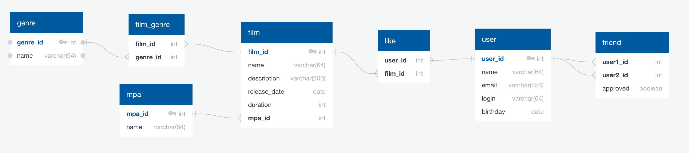

# java-filmorate

Database Scheme


Plotted with [QuickDBD](https://app.quickdatabasediagrams.com/#/) by following code:
```
Film
-
film_id PK int
name varchar
description varchar(200)
release_date date
duration int
rating enum

User
-
user_id PK int
name varchar
email varchar
login varchar
birthday date

Likes
-
user_id int FK >- User.user_id
film_id int FK >- Film.film_id

Friends
-
user1_id int FK >- User.user_id
user2_id int FK >- User.user_id
approved boolean

Genre
-
genre_id int PK
name varchar

FilmGenre
-
film_id int FK >- Film.film_id
genre_id int FK >- Genre.genre_i
```